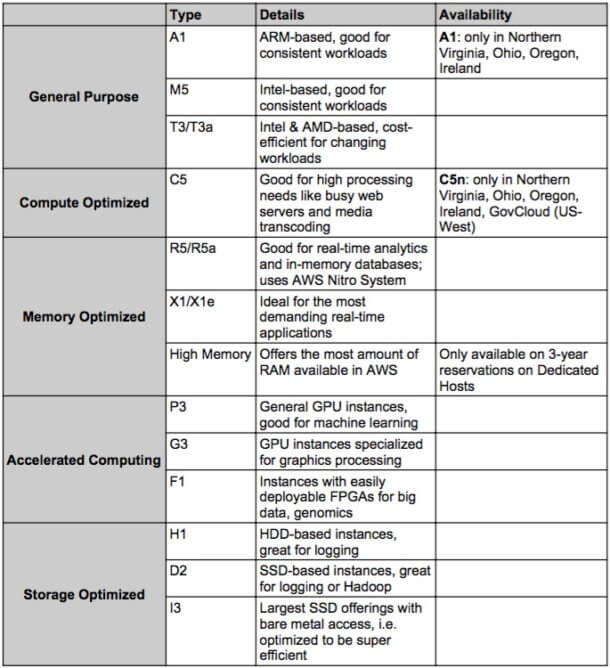
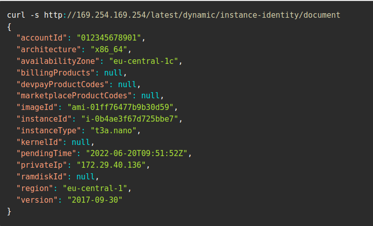

EC2 Notes
-------------
# EC2
   - EC2 basics,Terminology and  understanding the console
   - 
   - EC2 Tenancy attributes
   - EC2 instance types
   - Instance family
   - Creating Instance,Security group.
   - Pem and ppk file
   - Pem to PPK converion 
   - AWSCLI and configure AWS keys
   - Upgrade the instance.
   - AWS Metadata information.
   - EC2 purchase options.
   - Attaching Roles.
   - Create IAM users using cli
   
 
 - AMI overview
 - Create a new AMI
 - Creating instance from AMI
 - Private IP and public IP
 - EBS volumes types
 - Creating and Attach EBS volumes
 - Securing EBS volumes
 - Creating SNAPSHOTs
 - Understanding EC2 placement group, hibernate, nitros and new generation instances.
 - spot instances vs Reserved instances.
 - Install SSM Agent
 - Install Cloudwatch Agent

keywords :- cpu credits, 


## EC2 Instance Launch process 
  - OS Image
  - Instance type Selection
  - Networking (VPC and subnet)
  - Key pair
  - Role attachment
  - Storage allocation
  - Configure Security Group ::- Inbound rules.
  - Other options(Placement,Userdata)
  - Launch of EC2

 ## EC2 instance types
 Each instance type comes with different specifications for CPU, memory, storage, and networking capabilities. 
 It’s important to choose the appropriate instance type based on your specific workload requirements, performance needs, and budget considerations.

 ### AWS has the following naming convention for instances
      m5.xlarge
       m ::- instance class 
       5 ::- generation 
       xlarge ::- size within the instance class he size of EC2 instances typically follows a pattern, 
                 starting with small sizes and progressively increasing to ``medium, large, xlarge, 2xlarge``` and so on
       		
 ## EC2 instance types
 - ```General Purpose```:
   General-purpose instances are well-suited for a wide range of workloads, including ```web servers and code repositories```.
   Employs balance between ```compute, memory, and networking``` resources.
   With general-purpose instances, users can expect optimal performance and efficiency, as they are designed to handle diverse workloads effectively.
   
 - ```Compute Optimized```
   Compute optimized instances are specifically designed to handle compute-intensive tasks that demand high-performance processors.
   Usecases: ```Workloads, media transcoding, high-performance web servers, high-performance computing, scientific modeling, and machine learning, as well as dedicated gaming servers```.
   hese workloads necessitate a robust and capable CPU to ensure fast and efficient processing, making compute optimized instances the ideal choice for these demanding tasks
     
 - ```Memory Optimized```
   Memory optimized instances are specifically designed to deliver fast performance for workloads that involve ```processing large datasets in memory```
   Usecases: ```elational and non-relational databases, distributed web-scale cache stores, and in-memory databases optimized for business intelligence (BI)```
 Additionally, memory optimized instances excel in applications that require real-time processing of big unstructured data, enabling efficient and speedy data analysis and operations

- ```Storage Optimized```
  Storage optimized instances are well-suited for tasks that demand extensive, sequential read and write access to ```large data sets stored locally```.
  By leveraging the high storage capacity and optimized storage performance of these instances, organizations can efficiently handle data-intensive workloads and achieve optimal performance for their storage-centric applications
   ```H1 and D2 instances are part of the Dense storage offerings that provide high sequential read-writes for large data sets, such as in distributed Hadoop deployments```
      with H1 providing a maximum of 16 TB and D2 providing a maximum of 48 TB.

- ```Accelerated Computing```
  Include additional hardware (GPUs, FPGAs) to provide massive amounts of parallel processing for tasks such as graphics processing.X1, X1e
	P3: These are the general GPU offerings, good for machine learning and offering robust parallel processing abilities.
	G3: These are the GPU offerings that are specialized for graphics-intensive tasks such as rendering, encoding, and streaming.
	F1: These are instances that offer FPGAs for accelerated processing. You can leverage the FPGAs multiple ways over time for different enhancements, and all this is aided by custom 		FPGA-specific AMIs (called AFIs) that offer quicker deployment and development options compared to conventional FPGAs.
   
  
    
  
      
## EC2 instance states
  - Pending
  - running
  - stopping; stopped
  - terminated
    

## Login to EC2 instance.
  - pem file and its permission login via linux console
  - pem file to PPK file conversion using puttygen and login via putty

## Installing AWS CLI and Role Attachment 
   - Method 1
     ```yum install awscli```
   - Method 2  
     ```
      curl "https://awscli.amazonaws.com/awscli-exe-linux-x86_64.zip" -o "awscliv2.zip"
      unzip awscliv2.zip
      cd awscliv2
      ./install.sh
     aws configure  ::- Mention the region,AWS AcessKey and Secret Key 
     ```
   - Documents
     ```
      https://docs.aws.amazon.com/cli/latest/userguide/getting-started-install.html
      https://awscli.amazonaws.com/v2/documentation/api/latest/reference/index.html
     ```
   - Few Sample command:
     ```bash
     aws iam create-group --group-name MyIamGroup
     aws iam create-user --user-name MyUser
     aws iam add-user-to-group --user-name MyUser --group-name IAMreadonly
     ```
  
 ## Types of EC2 instances
   - On demand :- Pay for what you use,No unfront fees,no commitments
   - Reserved instances
        Upto 75% discount , Compared to ondemand
	Maximum savings :- Pay upfront for long term commitments
	Reserve Specific instance types
	we need to reserve instance for minimum of 1 year
   - Spot Instances
      To offset the loss of idle infrastructure, AWS offers this excess capacity at a massive discount to drive usage. That is why spot instances pricing is so affordable in comparison to EC2 pricing on demand
     ```This discounted Amazon EC2 spot instance pricing comes with a caveat. AWS can “pull the plug” and terminate spot instances with just a 2 minute warning. These interruptions occur when AWS needs to draw from the excess capacity to service customers who purchased reserved instances, savings plans or on-demand instance```
      Usecases:- Big Data running on AWS EMR, Hadoop or Spark are great candidates for spot instances.
      Distributed DBs such as Elasticsearch, Cassandra, Mongo which can handle a “reboot” of a single instance without losing data or affect service, can also run on spot instances.

     	- ```Strategies for Using Spot Instances```
     	  There are 2 key strategies for using Spot Instances:
     		  - Maintain a minimum number of compute resources by launching a core group of On-Demand Instances and supplementing them with Spot Instances when required.
     	  
		  - Launch Spot instances with a fixed duration, called Spot blocks, which are designed to be uninterrupted and run continuously for the duration you choose. 

     

## EC2 Meta Data URL
```http://169.254.169.254/latest/meta-data/```

 
 
 - Get the instance type
 ```curl -s http://169.254.169.254/latest/meta-data/instance-type```
 - Get the AMI ID
 ```curl -s http://169.254.169.254/latest/meta-data/ami-id```
 - Get the AWS region
 ```curl -s http://169.254.169.254/latest/dynamic/instance-identity/document|grep region|cut -f2 -d ":"|sed 's/.```
- Get the public IP Address
 ```curl -s http://169.254.169.254/latest/meta-data/public-ipv4```
 - Get the Instance ID
 ```curl -s http://169.254.169.254/latest/meta-data/instance-id```

 
 


EC2 Tenancy Attributes
----------------------
Shared :- The EC2 instance runs on shared hardware even with other customers.
Dedicated:- EC2 instance runs on hardware which will only be shared b/w same account AWS instnaces.

Dedicated host is a physical server that allows us to use user our existing per-socket,per-core or even per VM based software licences which inclues
Windows server, SUSE and various others.
with Dedicated Hosts, we can user the same physical server over the time, even if the instances is stopped and started


 Dedicated hots
 A physical machines with more visibility into undelying sockets/physical cores of hardware.
 More expensive.

Placemen group;
if you want to control the ec2 instance placement
- Cluster :- low latency single AZ
Usecase:- If the application requires extremly low latency and high throughput,Big data job that needs to complete fast.

-Partitions:- Spreads instances across many different partitions
			Partitions are setup racks, within AZ we have different partitions
Usecase: HDFS,Hbase,Cassandera

ENI :- Its the logical components in a VPC, that represents a virtual network card.
An instance can multiple ENI


# Security group
- Security groups are the central component of AWS firewalls.
- A security group acts as a firewall that controls the traffic allowed to and from the resources in your virtual private cloud (VPC). You can choose the ports and protocols to allow 	 
  for inbound traffic and for outbound traffic.
- For each security group, you add separate sets of rules for inbound traffic and outbound traffic.


# Important Pointer for Security Group

1.Don’t open ports for 0.0.0.0/0 unless specifically required
Allowing incoming access by opening up ports for 0.0.0.0/0 in security groups is the most common mistake made by professionals when provisioning resources. Users end up opening their cloud networks and exposing their cloud resources and data to outside threats.

2.Grant access from specific Amazon EC2 security groups or particular IP addresses for any security group rule.

“Amazon Relational Database Service (Amazon RDS) has security group configurations which are examined explicitly, and a warning is released if a rule for security group grants or is probable to grant excessive access to your database. For any security group rule, it is recommended that access from only certain Amazon Elastic Compute Cloud (Amazon EC2) security groups or from a particular IP address should be granted.”

3. Close unnecessary system ports.
Close the ports if nolonger necessary.

4.Regularly revisit your security groups to optimize rules

5.Periodically audit security groups to identify those not following the established naming convention

6. Authorize only specific IAM principals to create and modify security groups.

7. Add tags to your resources to help organize and identify them, such as by purpose, owner, or environment


# Components of Security Group
- protocool  ::- The protocol to allow. The most common protocols are 6 (TCP), 17 (UDP), and 1 (ICMP).
- port ::- 22, 6000-8000
- Network::- 203.0.113.1/32.
- Description(optional)


