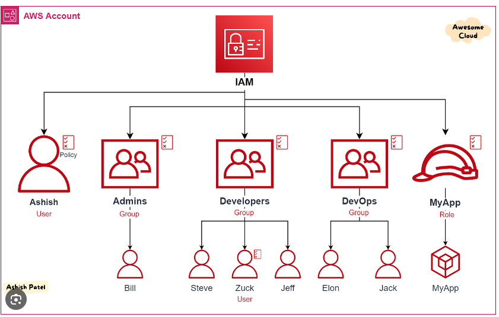

# IAM
- IAM
- IAM Features
- IAM users,Roles,Policies
- IAM Group
- IAM Role Usecases
- IAM User Access/Secret Key
- Key Rotation Policy
- IAM Credential Document
- IAM Best Practices

## Scenario
Point 1
- Imagine you joined a company and you would get Access card and subject to access spedfic rooms
 - you wont access to HR room officials
 - you wont access to  Company Executives
 etc
 
 In short IT team will give you access according to the job -role
  when you get promoted you will be give more access

Point 2
Imagine you Another team member who got access they have a different access than yours.


## IAM 
IAM is Global resource.
AWS Identity and Access Management is a core infrastructure service that provides the ```foundation for access control based on identities within AWS.```

AWS Identity and Access Management (IAM) is a web service that helps you securely
control access to AWS resources.
With IAM, you can centrally manage permissions that control which AWS resources
users can access.


## IAM Features
- Shared access to your AWS account
- Granular permissions
- Secure access to AWS resources for applications that run on Amazon EC2
- Multi-factor authentication (MFA)
- Identity federation
- PCI DSS Compliance
- Integrated with many AWS services
- Free to use

## How you use IAM differs, depending on the work that you do in AWS.
- ```Service user``` – If you use an AWS service to do your job, then your administrator provides you with the credentials and permissions that you need.
- ```Service administrator``` - If you're in charge of an AWS resource at your company you probably have full access to IAM.
- It's your job to determine which IAM features and resources your service users should access.
- As you use more advanced features to do your work, you might need additional permissions.
- ```IAM administrator``` – If you're an IAM administrator, you manage IAM identities and write policies to manage access to IAM.
- It provides two essential functions to work together ```Authentication``` and ```Authorization```

### Authentication 
- Validates the identity of a user or a service.
- Federate corporate identities

### Authorization
- Defines the permissions and limits access to only specific resources for the permitted user


## IAM Users
An IAM user is an identity within your AWS account that has specific permissions for a single person or application. Where possible, we recommend relying on temporary
credentials instead of creating IAM users who have long-term ```credentials such as passwords and access keys```. However, if you have specific use cases that require long-term
credentials with IAM users, we recommend that you rotate access keys.

### LAB::- Creating a IAM user and password for webconsole
### LAB::- Creating IAM keys and understading the best practices.

## IAM Group
It is an identity that specifies a collection of IAM users. You can use groups to specify permissions for multiple users at a time. Groups make permissions easier to manage for large sets of users.



##
## IAM Roles
A role is a set of permissions that grant access to actions and resources in AWS.
An IAM role is an identity within your AWS account that has specific permissions.It is similar to an IAM user, but is not associated with a specific person. You can assume a role by calling an AWS CLI or AWS API.

- Better security
- No need for rotation.
- No keys in the code.

### IAM roles with temporary credentials are useful in the following situations:

- Federated user access:: - IAM supports identity federation. If the user is already authenticated, such as through a Facebook or Google account, IAM can be made to trust that authentication method and then allow access based on it
- Temporary IAM user permissions
- Cross-account access:
- Service role ::-A service role is an IAM role that a service assumes to perform actions on your behalf.

## Permissions and Policies
You manage access in AWS by creating policies and attaching them to IAM identities (users, groups of users, or roles) or AWS resources. A policy is an object in AWS that, when associated with an identity or resource, defines their permissions. AWS evaluates these policies when an IAM principal (user or role) makes a request. Permissions in the policies determine whether the request is allowed or denied. Most policies are stored in AWS as JSON documents

### Policy types
- ```Identity-based policies```:- Attach managed and inline policies to ```IAM identities (users, groups to which users belong, or roles)```. Identity-based policies grant permissions to an identity
- ```Resource-based policies```:- Attach inline policies to resources. The most common examples of resource-based policies are Amazon S3 bucket policies
-  ```Permissions boundaries``` :- That policy defines the maximum permissions that the identity-based policies can grant to an entity.
-  ```Organizations SCPs``` :- Use an AWS Organizations service control policy (SCP) to define the maximum permissions for account members of an organization or organizational unit (OU). SCPs limit permissions that identity-based policies or resource-based policies grant to entities (users or roles) within the account, but do not grant permissions


### Overview of  Policies
  Most policies are stored in AWS as JSON documents Identity-based policies and policies used to set permissions   boundaries are ```JSON policy documents``` that you attach to a user or role.

- One ore more individual statements
- Optional policy-wide informaton at the top of the document.

### Disecting the policy

```json
{
  "Version": "2012-10-17",
  "Statement": [
    { "Sid": "ExampleStatementID",
      "Effect": "Allow",
      "Action": "s3:ListAllMyBuckets",
      "Resource": "*"
    }
  ]
}
```
```Version``` policy element specifies the language  syntax rules that to be use to process a policy.
2012-10-17 Current version ::- All the policy varibles will be supported in this version
${aws:username}

2008-10-17 earlier version

```statement``` element is the main element for a policy.  The Statement element can contain a single statement or an array of individual statements. Each individual statement block must be enclosed in curly braces { }. For multiple statements, the array must be enclosed in square brackets [ ].
```json "Statement": [{...},{...},{...}] ```

```sid``` You can provide Sid (statement ID) as an optional identifier for the policy statement
The Sid element supports ASCII uppercase letters (A-Z), lowercase letters (a-z), and numbers (0-9).          

```Effect``` The Effect element is required and specifies whether the statement results in an allow or an explicit deny. Valid values for Effect are Allow and Deny

```Principal``` Use the Principal element in a ```resource-based``` JSON policy to specify the principal that is allowed or denied access to a resource.


### Policy on Multiple resources
```json
{
    "Version": "2012–10–17",    
    "Statement": {
    "Effect": "Allow",
    "Action": [
        "iam:AddUserToGroup",
        "iam:RemoveUserFromGroup",
        "iam:GetGroup”
        ],
	"Resource": [
        	"arn:aws:iam::609103258633:group/Developers",
        	"arn:aws:iam::609103258633:group/Operators"
        ]
    }
}
```

### IAM Policy with Condition Example-1 
```json
{
    "Version": "2012-10-17",
    "Statement": {
        "Effect": "Allow",
        "Action": "*",
        "Resource": "*",
        "Condition": {
            "IpAddress": {
                "aws:SourceIp": "115.99.177.174/32"
            }
        }
    }
}
```
### IAM Policy with condition Example 2
```json
{
    "Version": "2012-10-17",
    "Statement": [
        {
            "Sid": "StartStopIfTags",
            "Effect": "Allow",
            "Action": [
                "ec2:StartInstances",
                "ec2:StopInstances"
            ],
            "Resource": "arn:aws:ec2:region:account-id:instance/*",
            "Condition": {
                "StringEquals": {
                    "aws:ResourceTag/Project": "DataAnalytics",
                    "aws:PrincipalTag/Department": "Data"
                }
            }
        }
    ]
}
```
### IAM Policy with condition Example 3
```json
{
  "Statement": [
    {
      "Effect": "Allow",
      "Action": "ec2:*",
      "Resource": "*",
      "Condition": {
        "StringEquals": {
          "aws:RequestedRegion": "ap-south-1"
        }
      }
    }
  ]
}
```


### Following identity based policy allows the implied principal to ist a single Amazon S2 bucket named example_bucket

```json
{
  "Version": "2012-10-17",
  "Statement": {
    "Effect": "Allow",
    "Action": "s3:ListBucket",
    "Resource": "arn:aws:s3:::example_bucket"
  }
}
```
### Multiple Policy with conditions.

```json
{
  "Version": "2012-10-17",
  "Statement": [
    {
      "Sid": "FirstStatement",
      "Effect": "Allow",
      "Action": ["iam:ChangePassword"],
      "Resource": "*"
    },
    {
      "Sid": "SecondStatement",
      "Effect": "Allow",
      "Action": "s3:ListAllMyBuckets",
      "Resource": "*"
    },
    {
      "Sid": "ThirdStatement",
      "Effect": "Allow",
      "Action": [
        "s3:List*",
        "s3:Get*"
      ],
      "Resource": [
        "arn:aws:s3:::confidential-data",
        "arn:aws:s3:::confidential-data/*"
      ],
      "Condition": {"Bool": {"aws:MultiFactorAuthPresent": "true"}}
    }
  ]
}
```

### Understanding the Principle Element
A principal elemetn is used to specify things like ```IAM user,federated user, IAM role, AWS accounts, AWS services``` or other  principal entity that is allowed or denied access to a resource.
Principal element is used with resource based plicy we cannot use a principal element in a IAM-based policy

Result Alice will be able to access the demo s3 bucket.

```json
{
    "Version": "2012-10-17",
    "Statement": [
        {
            "Sid": "SamplePolicy",
            "Effect": "Allow",
            "Principal": {
                "AWS": "arn:aws:iam::888913816489:user/Alice"
            },
            "Action": "s3:*",
            "Resource": [
                "arn:aws:s3:::the-demo-s3-bucket",
                "arn:aws:s3:::the-demo-s3-bucket/*"
            ]
        }
    ]
}
```
### Example 2
```json
{
    "Version": "2012-10-17",
    "Statement": [
        {
            "Sid": "SamplePolicy",
            "Effect": "Deny",
            "NotPrincipal": { 
                "AWS": "arn:aws:iam::888913816489:user/Alice"
                "AWS": "arn:aws:iam::888913816489:user/Bob"
            },
            "Action": "s3:*",
            "Resource": [
                "arn:aws:s3:::the-demo-s3-bucket",
                "arn:aws:s3:::the-demo-s3-bucket/*"
            ]
        }
    ]
}
```
``` This mean expect Bob and Alice, all the users are denied and even admin wont be able to access this s3 bucket But to make this work we need explict allow for Alice and Bob in the IAM policy ```

### Policy Variables Example

```json
 {
    "Version": "2012-10-17",
    "Statement": [
        {
            "Action": [
                "iam:*AccessKey*"
            ],
            "Effect": "Allow",
            "Resource": [
                "arn:aws:iam::888913816489:user/${aws:username}"
            ]
        }
    ]
}
```
## Best practices of IAM
- Lock away your AWS account root user access keys
- Create individual IAM users
- Use user groups to assign permissions to IAM users
- Grant least privilege
- Get started using permissions with AWS managed policies
- Validate your policies
- Use customer managed policies instead of inline policies
- Use access levels to review IAM permissions
- Configure a strong password policy for your users
- Enable MFA
- Use roles for applications that run on Amazon EC2 instances
- Use roles to delegate permissions
- Do not share access keys
- Rotate credentials regularly
- Remove unnecessary credentials
- Use policy conditions for extra security
- Monitor activity in your AWS account
     - Using AWS cloudtrails, CLoudWatch, AWS config 

## IAM compliance rules

- IAM Access Keys Rotation
- Unnecessary IAM Access Keys not used > 90
- Unused IAM Groups
- Inactive IAM Users
- Unused IAM Users password > 90 days unused
- IAM Users with Password and Access Keys
- IAM user having policy
- IAM user password with inactive keys
- IAM policy should not have resource  s3.* //No full access
- IAM with old ssh_keys
- IAM users with keys and password enabled.

