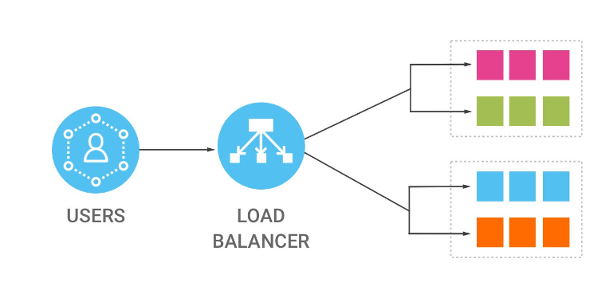

# Load Balancer
In Amazon Web Services (AWS), a load balancer is a managed service that helps ```distribute incoming network traffic across multiple targets```,such as EC2 instances, containers, IP addresses, or Lambda functions. 
The primary purpose of a load balancer is to enhance the availability and fault tolerance of your applications by evenly distributing traffic across multiple resources, thereby preventing any single resource from becoming overwhelmed and causing a bottleneck.



## Types of Load Balancer.
Layer 4 (Transport Layer): Network Load Balancer (NLB) operates at this layer, distributing traffic based on IP protocol data.

Layer 7 (Application Layer): Application Load Balancer (ALB) operates at this layer, enabling intelligent routing decisions based on application-level data, such as HTTP headers, paths, and hostnames.

## Benfits of Load Balancer.

Load balancers in AWS provide various benefits,

```High availability```: 
Load balancers continuously monitor the health of targets and route traffic only to healthy ones, ensuring that your application remains available even if some resources fail.

```Scalability```: 
Load balancers can automatically scale to handle varying levels of incoming traffic, distributing it across multiple targets as needed.

```Security```: 
Load balancers support SSL termination, enabling encrypted connections between clients and the load balancer, and can also help protect against common security threats, such as Distributed Denial of Service (DDoS) attacks.


## 3 types of load balancers:

### Classic load Balancer.
The Classic Load Balancer (CLB) is one of the types of load balancers provided by Amazon Web Services (AWS). It was the first load balancer service offered by AWS before the introduction of Application Load Balancer (ALB) and Network Load Balancer (NLB).
CLB can balance HTTP and HTTPS traffic.It doesn't support the newer features provided by Application Load Balancer (ALB) and Network Load Balancer (NLB).

### Application Load Balancer.
ALB operates at the application layer (Layer 7) and is capable of routing HTTP/HTTPS requests.
It supports features like path-based routing, host-based routing, and containerized applications via integration with Amazon ECS and EKS.

### Network Load Balancer.
NLB operates at the transport layer (Layer 4), making it suitable for balancing TCP, UDP, and TLS traffic.
It is highly scalable and can handle millions of requests per second.
NLB is often preferred for scenarios requiring extreme performance and low latency, such as gaming applications or real-time communication
