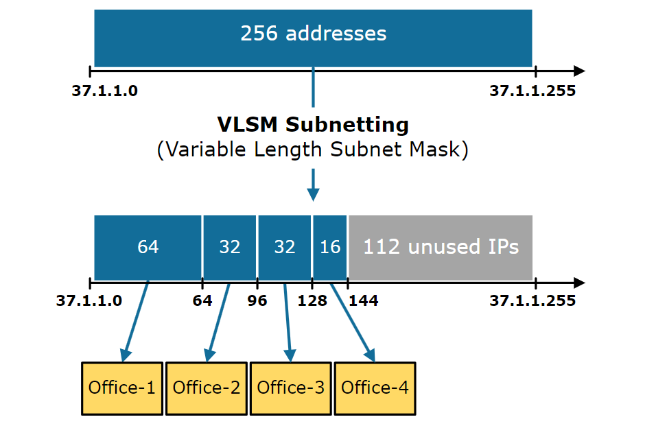

# Networking Basic.
- IP address
- subnet.


An IP (Internet Protocol) address is a unique numerical label assigned to each device connected to a computer network that uses the Internet Protocol for communication.
It serves two main purposes: identifying the host or network interface and providing the location of the host in the network.

a. IPv4
b. IPv6 

IP addresses are essential for devices to communicate over the Internet, enabling data packets to be routed between them

## Subnet.
A subnet, short for "subnetwork," is a smaller network within a larger network. It allows a single network to be divided into multiple smaller logical networks, each with its own set of IP addresses. 
Subnetting is a technique used to improve network performance, security, and management by segmenting a larger network into smaller, more manageable part.




### Here are the advantages of subnet.

```Efficient Use of IP Addresses```: Subnetting allows for the efficient allocation of IP addresses by breaking down a large address space into smaller, 
more manageable subnetworks. This prevents wastage of IP addresses and allows organizations to use their address space more effectively.

```Simplified Network Management```: Each subnet can have its own set of administrators, policies, and configurations, making it easier to monitor, troubleshoot, and maintain the network.

```Improved Network Performance```: By dividing a large network into smaller subnets, network traffic can be localized within each subnet. 
This reduces the amount of broadcast traffic and congestion on the network, leading to improved network performance and faster data transmission.

```Enhanced Security```: Subnets can be used to isolate different parts of the network from each other, improving security by restricting access between subnets.

```Scalability```: Subnetting provides scalability by allowing organizations to expand their network infrastructure as needed.
New subnets can be added to accommodate growth without disrupting the existing network architecture

