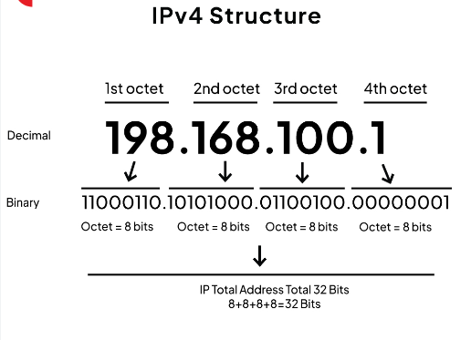
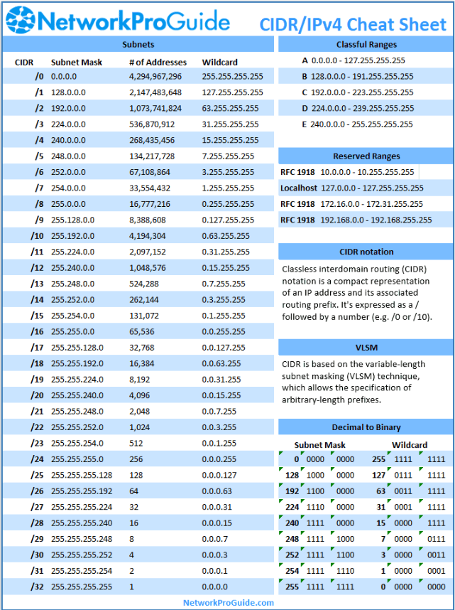

# Networking Basic.
- IP address
- subnet
- CIDR notation
- Private IP and Public IP


An IP (Internet Protocol) address is a unique numerical label assigned to each device connected to a computer network that uses the Internet Protocol for communication.
It serves two main purposes: identifying the host or network interface and providing the location of the host in the network.
IP addresses are essential for devices to communicate over the Internet, enabling data packets to be routed between them

a. IPv4
b. IPv6 




## Subnet.
A subnet, short for "subnetwork," is a smaller network within a larger network. It allows a single network to be divided into multiple smaller logical networks, each with its own set of IP addresses. 
Subnetting is a technique used to improve network performance, security, and management by segmenting a larger network into smaller, more manageable part.


### Here are the advantages of subnet.

```Efficient Use of IP Addresses```: Subnetting allows for the efficient allocation of IP addresses by breaking down a large address space into smaller, 
more manageable subnetworks. This prevents wastage of IP addresses and allows organizations to use their address space more effectively.

```Simplified Network Management```: Each subnet can have its own set of administrators, policies, and configurations, making it easier to monitor, troubleshoot, and maintain the network.

```Improved Network Performance```: By dividing a large network into smaller subnets, network traffic can be localized within each subnet. 
This reduces the amount of broadcast traffic and congestion on the network, leading to improved network performance and faster data transmission.

```Enhanced Security```: Subnets can be used to isolate different parts of the network from each other, improving security by restricting access between subnets.

```Scalability```: Subnetting provides scalability by allowing organizations to expand their network infrastructure as needed.
New subnets can be added to accommodate growth without disrupting the existing network architecture

## CIDR Notation
CIDR stands for Classless Inter-Domain Routing. It's a method used to allocate and manage IP addresses more efficiently on the Internet.
CIDR can create networks of different sizes based on their needs, rather than being limited to predefined classes.




## Private IP and Public IP
Private IP addresses are reserved for use within private networks and are not routable on the public Internet.These private IP address ranges are commonly used in ```home and business networks for internal communication, such as connecting computers, printers, servers, and other network devices```. It's important to note that private IP addresses are not unique globally and can be reused in different private networks.
To communicate with devices on the public Internet, private IP addresses must be translated to public IP addresses using techniques like Network Address Translation (NAT) when accessing external resources.

### Here are the IPV4 Private Address Ranges
IPv4 Private Address Ranges:
- 10.0.0.0 to 10.255.255.255 (10.0.0.0/8)
- 172.16.0.0 to 172.31.255.255 (172.16.0.0/12)
- 192.168.0.0 to 192.168.255.255 (192.168.0.0/16)

# Public IP address.
A public IP address is an address that is used to uniquely identify a device on the Internet. It's assigned by an Internet Service Provider (ISP) or a network administrator and is routable on the public Internet. Public IP addresses are globally unique and can be accessed from any location on the Internet.

Public IP addresses are typically used by devices that need to communicate directly with other devices or servers on the Internet, such as web servers, email servers, and gaming servers. They are essential for hosting services and applications that need to be accessible to users worldwide.

Public IP addresses can be dynamic or static. Dynamic public IP addresses are assigned dynamically by the ISP and may change over time, while static public IP addresses remain constant and are typically used for services that require consistent accessibility, such as web hosting or remote access services.
