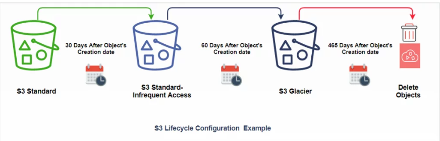

# S3
- what is S3
- Buckets and objects
- Uploading objects to Buckets
- S3 bucket versioning
- S3 Bucket encryption
- S3 bucket Lifecycle policies
- S3 central bucket concept + LAB
- S3 Replication
- S3 bucket best practices

## What is S3
- Amazon S3 (Simple Storage Service) is an object storage service that offers industry-leading scalability,   
   ```data availability, security, and performance```
- Amazon S3 allows people to store ```objects (files) in “buckets” (directories)```
- Buckets must have a ```globally unique name``` (across all region all accounts)
- Buckets are defined at the region level
- S3 looks like a global service but buckets are created in a region

## Usecases of S3 bucket 
- Backup and Storage
- Disaster Recovery
- Archive
- Hybrid Cloud Storage
- Media Hosting
- Datalake and Big data analysis
- Software delivery
- Static website

## Here are some key reasons why businesses and developers choose to use AWS S3 bucket:-
- `Scalability`::- AWS S3 provides virtually limitless scalability, enabling users to store and retrieve any amount of data without worrying about capacity constraints.
- `Durability` ::- S3 is designed to deliver 99.999999999% (11 nines) durability for objects, ensuring high data reliability. It replicates data across multiple facilities and geographic regions, reducing the risk of data loss and ensuring data availability even in the event of hardware failures, natural disasters, or other disruptions
- `Security` ::There are security controls that is designed for the data at rest, data at transit and even have security controls to access the data. t allows users to implement security best practices and compliance requirements, ensuring the protection of sensitive data stored within S3 buckets.
- `Versatility` :: S3 supports a wide range of use cases, such as data backup and recovery, media storage and distribution, hosting static websites, application data storage, and big data analytics. Its versatility makes it suitable for various industries, including e-commerce, media and entertainment, healthcare, finance, and more
- Ease of Use and Integration :: AWS S3 integrates seamlessly with other AWS services and third-party applications, allowing for easy data transfer and integration into existing workflows


## Eventual Consistancy 
Compared to a traditional file system, the disadvantage of object storage is that data consistency is achieved only eventually. 
Whenever you update a file, you may have to wait until the change is propagated to all of the replicas before requests will return the latest version. This makes object storage unsuitable for data that changes frequently.
But it's a great fit for all the data that doesn't change much, like backups, archives, video and audio files, 
and virtual machine images


## S3 Object.
- Objects (files) have a key-value
- The key is the full path: s3://my-bucket/folder1/folder2/file.txt
- Object values are the content of body
- Max. object size is 5TB
- if uploading more than 5GB, we must use “multi-part upload”


## Naming convention of S3 bucket.
- S3 looks like a global service but buckets are created in a region
- 3–63 character long
- not an IP
- must start with lowercase letter or number

### LAB 1:- Create a S3 bucket and upload object via UI
### LAB 2:- Upload object via awscli

## S3 verioning
Versioning is a means of keeping the multiple forms of an object in the same S3 bucket. Versioning can be used to retrieve, preserve and restore every version of an object in S3 bucket

### Versioing pointers
- It stores all versions of an object (including all writes and even if you delete an object)
- It is a great backup tool.
- Once the versioning enabled, it cannot be disabled, only suspended.
- It is integrated with lifecycle rules.
- Versioning's MFA Delete capability uses multi-factor authentication that can be used to provide the additional layer of security.
```Notes:-```
Any file that is not versioned prior to enabling versioning will have versioning null
Supending versioning does not delete the previous versions.

### LAB3:- Enable Versioning of the bucket.


## Hosting a website using s3
Using the static website hosting feature on an S3 bucket, we host static websites for one to two dollars a month and scale to handle millions of users.
URL will be in the format ```<bucket-name>.s3-website-<region>.amazonaws.com```

- ```step1: Enable static website hosting``` In the properties select the option ```Use this bucket to host a website```.
- ```step2: Enable s3 permissions```Naviage to the bucket , click on permission and select enable for s3 static website.
- ```step3: Bucket permissions``` Edit with below bucket policy
```json
{
    "Version": "2008-10-17",
    "Id": "PolicyForPublicWebsiteContent",
    "Statement": [
        {
            "Sid": "PublicReadGetObject",
            "Effect": "Allow",
            "Principal": {
                "AWS": "*"
            },
            "Action": "s3:GetObject",
            "Resource": "arn:aws:s3:::www.my-awesome-site.com/*"
        }
    ]
}
```
### Benfits of using website as S3:
- ```Cost``` ::- Hosting a website in S3 does not incur extra charges. You are paying standard S3 prices on GET requests and Data Transfer out of the bucket when a user visits your site.

- ```Maintenance``` :- Here is no longer any server side code to maintain and no web servers to configure and keep up to date.

- ```Scale``` :- S3 is a high availability and durable service that AWS maintains. If your website goes from 10 users a day to 10 million, S3 scales your website automatically.

- ```

### LAB4 :: Create a Static website.


## S3 Life cycle policies

 
 
- ```Lifecycle Management``` is used so that objects are stored cost-effectively throughout their lifecycle. 
- ```Lifecycle configuration``` is a set of rules that define the actions applied by S3 to a group of objects.


Amazon S3 has different storage classes. When we upload a file into S3 we can choose which storage class is apt for our files. There are 6 types of storage classes
- Standard
- Intelligent Tiering
- Standard Infrequent Access
- Glacier
- Glacier Deep Archive.

The Storage classes are classified into different categories based on
- Storage cost
- Object Durability
- Object Availbility
- Frequency of Access.


### The lifecycle defines two types of actions:
- ```Transition actions:``` :- When you define the transition to another storage class. For example, you choose to transit the objects to the Standard IA storage class 30 days after you have created them or archive the objects to the Glacier storage class 60 days after you have created them

- ```Expiration actions``` :- you need to define when objects expire, the Amazon S3 deletes the expired object on your behalf.


### `S3 Standard` 
- S3 have 99.99% availability and 99.99999999999% durability that means The objects in this storage class are highly available and the chance of losing that file is very very rare.
- We can store files which we use regularly.
- S3 is the most expensive storage standard among all others.
- The data is stored in multiple location.

### `S3 Standard Infrequent Access (IA)`
- This is used to store data which is accessed less frequently but need quick access when needed.
- The objects in this storage have 99.90% availability and 99.99999999999% object durability in different locations.
- It is less expensive than standard storage.
- Amazon charges a retrieval fee to retrieve the data.

### `S3 One Zone Infrequently Access:`
- This is a low-cost storage option compared to S3 standard storage and Standard Infrequent access.
- This is used to store infrequently accessed non-critical data or data which can be regenerated if lost because this storage class stores the data only in one facility.
- The objects in this storage have 99.5% availability and 99.99999999999% object durability in a single availability zone.
- Less expensive than standard storage classes.
  
### `Glacier and Glacier Deep archive :`
- Glacier is used for data archiving
- The data retrieval time can be from minutes to hours.
- Glacier Deep Archive is also used for data archiving but the retrieval time for Deep archive is 12 hours.
- The data durability is 99.99999999999%

### `Intelligent Tiering:`
- It monitors your data access patterns and moves the data to different storage classes accordingly.
- The objects in this storage have 99.90% availability and 99.99999999999% object durability in different locations.
- Less expensive than standard storage classes.

### `Glacier and Glacier Deep archive:` 
- Glacier is used for data archiving
- This is the cheapest storage S3 service.
- The data retrieval time can be from minutes to hours.
- Glacier Deep Archive is also used for data archiving but the retrieval time for Deep archive is 12 hours.
- The data durability is 99.99999999999%
  
  
### Usecases of Lifecycle policy
- Application server, database logs are stored in s3 but logs may not require after a few weeks or months, in this case, 
you can delete the objects automatically by applying an expiration action.

- Frequency of access requirement of an organization’s documents (financial, media, employee data) Some documents are frequently accessed, but after a few days or months, they are infrequently accessed. After some time, organization may need to archive them as documents are not used anymore but must be retained for regulatory compliance, in this case, you can use transition action.

### LAB 5 :: Create a Lifecycle policy for s3


## LAB:: S3 central Bucket

### Consider a case you will have S3 central back, data from all the ec2s in other account will ingest the data in central S3 bucket.

Account A:- Central account
Create a s3 bucket and attach below policy 
```json
{
    "Version": "2012-10-17",
    "Statement": [
        {
            "Effect": "Allow",
            "Principal": {
                "AWS": "arn:aws:iam::ACCOUNT-B-NUMBER:root"
            },
            "Action": [
                "s3:GetObject",
                "s3:PutObject",
                "s3:PutObjectAcl"
            ],
            "Resource": [
                "arn:aws:s3:::mykplabs-central/*"
            ]
        }
     ]
  }   
```        
        
step2 :- In Account B Create a ec2 role with below policy
```json
{
    "Version": "2012-10-17",
    "Statement": [
        {
            "Effect": "Allow",
            "Action": [
                "s3:GetObject",
                "s3:PutObject",
                "s3:PutObjectAcl"
            ],
            "Resource": "arn:aws:s3:::<bucket Account A>/*"
 
        }
    ]
}
```

Attach this role to ec2 use aws cli command to upload and download a file 


## S3 presigned URL
A presigned URL is a URL that you can provide to your users to grant temporary access to a specific S3 object. Using the URL, a user can either READ the object or WRITE an Object (or update an existing object). The URL contains specific parameters which are set by your application. A pre-signed URL uses three parameters to limit the access to the user.
- Bucket :- The bucket that the object is in (or will be in)
- Key :- The name of the object
- Expires :- "The amount of time that the URL is valid"

```aws s3 presign s3://config-XXXXX-itops/file2 --expires-in 60```


### S3 Best practices 

📌 Bucket Naming: Choose a unique and meaningful name for your S3 bucket. Bucket names are globally unique across all of AWS, so make sure to select a name that is not already in use.

📌 Data Classification: Clearly define the sensitivity of your data and implement appropriate access controls. Use AWS Identity and Access Management (IAM) policies to restrict access based on roles and permissions.

📌 Access Control Lists (ACLs) vs. Bucket Policies: You can control access to your S3 bucket using either Access Control Lists (ACLs) or Bucket Policies. It’s recommended to use IAM policies and bucket policies for more granular and manageable access control.

📌 Versioning: Enable versioning for your S3 buckets to maintain a historical record of changes to objects. This can be helpful in cases of accidental deletions or overwrites.

📌 Data Encryption: Implement data encryption both in transit and at rest. Use SSL/TLS for data in transit and server-side encryption (SSE) for data at rest. SSE options include SSE-S3, SSE-KMS, and SSE-C.

📌 Data Lifecycle: Set up data lifecycle policies to automatically transition objects to different storage classes (e.g., from Standard to Glacier) or to delete them after a specific period. This helps optimize costs and storage.

📌 Cross-Region Replication: Replicate your S3 objects across different AWS regions for disaster recovery and high availability. Cross-Region Replication (CRR) can be configured to automatically replicate objects to a target bucket in another region.

📌 Logging and Monitoring: Enable access logging for your S3 bucket to track who is accessing your objects. Additionally, use Amazon CloudWatch to monitor and set up alarms for various S3 metrics.

📌 Pre-Signed URLs: If you need to grant temporary access to specific objects without making them public, you can generate pre-signed URLs. These URLs grant time-limited access to the object based on the permissions you specify.

📌 Cost Optimization: Regularly review your storage usage and access patterns to optimize costs. Use S3 storage classes such as Standard, Intelligent-Tiering, and Glacier to match your data’s access frequency and durability requirements.


## S3 Advanced Policies
- S3 bucket level policy for Encryption at Transit

```json
{
  "Id": "EnforceSSLPolicy",
  "Version": "2012-10-17",
  "Statement": [
    {
      "Sid": "DenyInsecureRequests",
      "Action": "s3:*",
      "Effect": "Deny",
      "Resource": [
        "arn:aws:s3:::BUCKET-NAME",
        "arn:aws:s3:::BUCKET-NAME/*"
      ],
      "Condition": {
        "Bool": {
          "aws:SecureTransport": "false"
        }
      },
      "Principal": "*"
    }
  ]
}
```
- S3 bucket policy Encryption at rest
  
```json
{
    "Version": "2012-10-17",
    "Statement": [
        {
            "Effect": "Deny",
            "Principal": "*",
            "Action": "s3:PutObject",
            "Resource": "arn:aws:s3:::BUCKET-NAME/*",
            "Condition": {
                "Null": {
                    "s3:x-amz-server-side-encryption": "false"
                },
                "StringNotEqualsIfExists": {
                    "s3:x-amz-server-side-encryption": "AES256"
                }
            }
        }
    ]
}
```
