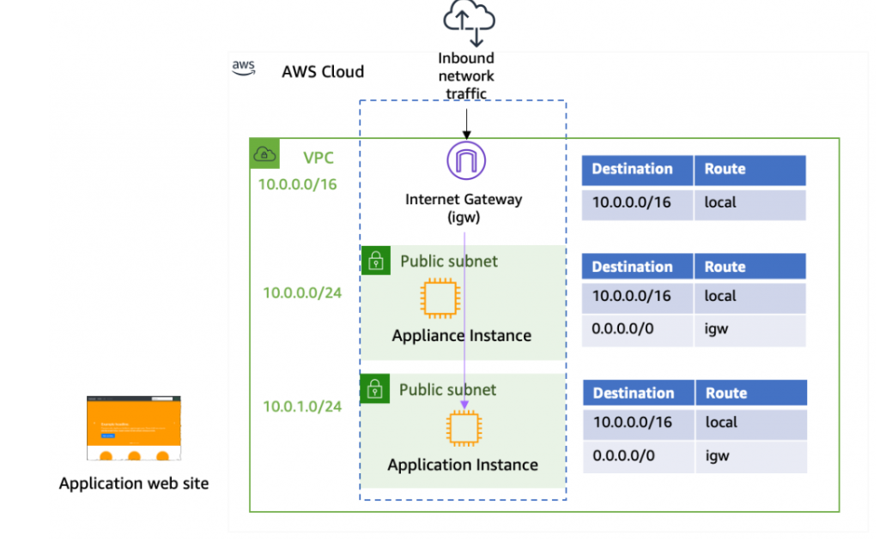

# VPC (Virtual private Cloud)
- Basic Networking fundamentals
- Subnet creation logic
- Using subnet calculators
- VPC creation
- Subents
- Route tables
- IGW
- NAT Gateway
- VPC peering
- VPC endpoints
- Transit Gateway :- Theory and Usecases
- Network Monitoring

## Basic Networking Fundamentals.
To connect and identify devices on a computer network, a unique numeric label is required, and this label is known as an ```IP (Internet Protocol) address```.
An IP (Internet Protocol) address is a unique numeric label assigned to devices connected to a computer network. The IP address is formatted in 32 bits, with each set of 8 bits separated by a dot (.) 
to make it easier for humans to read as we are more familiar with the decimal number system.
The IP address provides a special identification for devices on a network, allowing for the seamless transfer of data and information between them,
there are five classes of IP address which are discussed in detail.


IP addresses are divided into two parts:
- Network ::- The network part is used to define the unique class of the network,
- Host ::- The network part is used to define the unique class of the network

### Subnet Mask
- A subnet mask is a 32-bit number used in Internet Protocol (IP) addressing to divide an IP address into network and host portions. 

- It is used to identify which part of an IP address is the network address and which part is the host address. Subnet masks are used in conjunction with IP addresses to create subnetworks (subnets) within a larger network.

A subnet mask consists of two parts:
- Network bits:
  These bits are set to "1" in the subnet mask and represent the network portion of the IP address
  The number of network bits determines the size of the network. For example, a subnet mask of ```255.255.255.0 has 24 network bits```, meaning the first 24 bits of the IP address represent the network

- Host:
These bits are set to "0" in the subnet mask and represent the host portion of the IP address. The number of host bits determines the number of devices that can be connected to the network. In the example above, with 8 host bits remaining, you can have up to 2^8 (256) different host addresses within that subnet.

### IP Address Classes

## Class A
CLASS A — Range: 1.0.0.0 to 127.0.0.0
Class A IP addresses are designed for networks that require a large number of hosts. 
- Public IP Range: 1.0.0.0 to 127.0.0.0
- Number of Networks: 126
- Number of Hosts per Network: 16,777,214

## Class B
Class B addresses are intended for networks that are of medium to large size.
- IP Range: 128.0.0.0 to 191.255.0.0
- Number of Networks: 16,382.
- Number of Hosts per Network: 65,534

## Class C
Class C addresses are typically utilized in small local area networks (LANs).
With Class C, the first three octets are used for the network ID, allowing for approximately 2 million networks.
Public IP Range: 192.0.0.0 to 223.255.255.0
Number of Networks: 2,097,150
Number of Hosts per Network: 254

## CLASS D — Range: 224.0.0.0 to 239.255.255.255
Class D IP addresses are designated for multicasting purposes and are not assigned to individual hosts. Multicasting is a mechanism that allows a single host to send data streams to multiple hosts simultaneously over the Internet. Applications for multicasting include audio and video streaming, as well as real-time stock market data delivery to multiple brokerage firms.
Range: 224.0.0.0 to 239.255.255.255

## CLASS E — Range: 240.0.0.0 to 255.255.255.255
Class E IP addresses are a set of IP addresses reserved specifically for research purposes. Unlike other IP address classes, they are not intended for general use in networking


## VPC.
AWS VPC (Amazon Virtual Private Cloud) is a service provided by Amazon Web Services (AWS) that allows users to create a private, isolated section of the AWS cloud where they can launch their resources and services. It enables users to build a virtual network in the AWS cloud, complete with subnets, route tables, and security settings, similar to how they would set up a traditional network in an on-premises data center.

Note::- AWS default VPC with this CIDR block 172.31.0.0/16. This provides 65,536 private IPv4 address

### Here are the components of VPC.

```Isolated Virtual Network```: AWS VPC provides a logically isolated section of the AWS cloud where users can launch AWS resources, such as EC2 instances, databases, and load balancers, within their own virtual network.

```Subnets```: Users can divide their VPC into multiple subnets, each associated with a specific Availability Zone (AZ) within a selected AWS region. Subnets allow users to organize their resources and control network traffic flow.

```Internet Gateway (IGW)```: An Internet Gateway enables resources within the VPC to communicate with the public Internet and vice versa. It serves as a gateway for outbound and inbound traffic.
Route tables act as maps for directing traffic within your VPC. They define where network traffic is directed, be it to other instances within the VPC or outside to the internet.

```Route Tables```: Route tables define the routing rules for traffic within the VPC. Users can configure route tables to direct traffic between subnets, to an Internet Gateway, or to other network devices, such as Virtual Private Gateways (VGWs) for connecting to on-premises networks.

```Security Groups and Network Access Control Lists (NACLs)```: Users can define security rules at the instance level using security groups and at the subnet level using NACLs. These security mechanisms allow users to control inbound and outbound traffic to their resources.

```VPC Peering```: VPC Peering allows users to connect multiple VPCs within the same AWS region and route traffic between them as if they were part of the same network.

### Here is the VPC CIDR and subnet CIDR.

##### MainSubnet
10.0.0.0/16 

##### VPC CIDR
- subnet1:- 10.0.1.0/24
- subnet2:- 10.0.2.0/24
- subnet3:- 10.0.3.0/24


Note 5 IPs will be reserved 
- 10.0.1.0 :- For Network
- 10.0.1.1 :- AWS routing 
- 10.0.1.2 :- AWS DNS
- 10.0.1.3 :- for AWS Future purpose
- 10.0.1.255 :- Boradcasting
- By default subnets can talk each other no rule is required in RT

### Route table 
A default/Main RT will be created when VPC is created 
if there is no route table created All the subnets will be associated with default RT.





