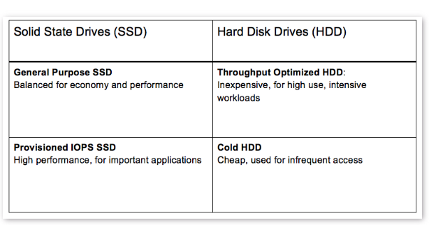

# VolumesAndSnapshots

- what is meant by EBS volume
- what are different types of EBS volumes
- Volume state
- How to Create and Attach volume
    - Disk partitioning
- Creating a Snapshot out from a volume
- Create Volume from a snapshot
- AMI
- Copy AMI to Different Regions.


## EBS Volumes
Elastic Block Store (EBS) is a block storage service based in the AWS cloud. EBS stores huge amounts of data in blocks, which work like hard drives (called volumes). 
You can use it to store any type of data, including file systems, transactional data, ```NoSQL and relational databases, backup instances, containers, and application```
```EBS volume data persists independently of the life of the instance```

- Termination protection is turned off by default and must be manually enabled (keeps the volume/data when the instance is terminated).
  
- Volume sizes and types can be upgraded without downtime (except for magnetic standard).

- To migrate volumes between AZ’s create a snapshot then create a volume in another AZ from the snapshot (possible to change size and type).

- You can have up to 5,000 EBS volumes by default. You can have up to 10,000 snapshots by default.

### Usecases
- ```Frequent Updates``` - Storage of data that needs frequent updates. For example database application, instances system drive
- ```Throughput-Intensive application``` - that need to perform continous disk scans.

## Classification of EC2



## EBS Volume types


##Best Practices of EBS volumes
- EBS volume must be encypted
- EBS General Purpose SSD
- EBS Volume Naming Conventions
- EBS Volumes Attached To Stopped EC2 Instances
- EBS Volumes Too Old Snapshots
- Idle EBS Volume
