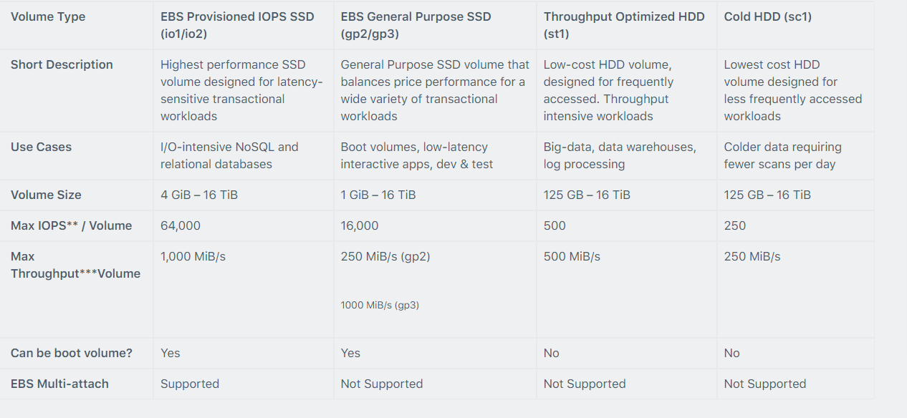
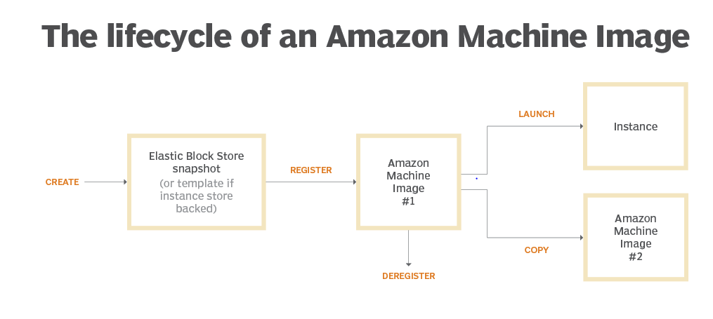

# VolumesAndSnapshots

- what is meant by EBS volume
- what are different types of EBS volumes
- Volume state
- How to Create and Attach volume
    - Disk partitionin
- How to extent the EBS volume.
- What are AWS Snapshots.
- Creating a Snapshot out from a volume
- Create Volume from a snapshot
- AMI
- Copy AMI to Different Regions.
- Instance Store.


## EBS Volumes
Elastic Block Store (EBS) is a block storage service based in the AWS cloud. EBS stores huge amounts of data in blocks, which work like hard drives (called volumes). 
You can use it to store any type of data, including file systems, transactional data, ```NoSQL and relational databases, backup instances, containers, and application```
```EBS volume data persists independently of the life of the instance```

- Termination protection is turned off by default and must be manually enabled (keeps the volume/data when the instance is terminated).
  
- Volume sizes and types can be upgraded without downtime (except for magnetic standard).

- To migrate volumes between AZ’s create a snapshot then create a volume in another AZ from the snapshot (possible to change size and type).

- You can have up to 5,000 EBS volumes by default. You can have up to 10,000 snapshots by default.

### Usecases
- ```Frequent Updates``` - Storage of data that needs frequent updates. For example database application, instances system drive
- ```Throughput-Intensive application``` - that need to perform continous disk scans.

## Classification of EC2


## EBS Volume types


## Amazon EBS Snapshots.
- Snapshots capture a point-in-time state of an instance.
- Can be used to convert an unencrypted volume to an encrypted volume.
- Snapshots are stored on Amazon S3
- Even though snapshots are saved incrementally, the snapshot deletion process is designed so that you need to retain only the most recent snapshot to restore the volume.
- EBS volumes are AZ specific, but snapshots are region specific
- Volumes can be created from EBS snapshots that are the same size or larger.

## AMI Amazon Machine Image
An Amazon Machine Image (AMI) is a special type of virtual appliance that is used to create a virtual machine within the Amazon Elastic Compute Cloud (“EC2”).

An AMI includes the following:
- A template for the root volume for the instance (for example, an operating system, an application server, and applications).
- Launch permissions that control which AWS accounts can use the AMI to launch instances.
- A block device mapping that specifies the volumes to attach to the instance when it’s launched.

## Preview of AMI



## Instance Store.
An Amazon Web Services (AWS) instance store is a type of storage option provided by AWS for EC2 (Elastic Compute Cloud) instances. It provides temporary block-level storage for EC2 instances, meaning the data stored on an instance store volume is temporary and will be lost if the ```instance is stopped, terminated```, or if the underlying hardware fails.

```Instance store volumes are physically attached to the host computer that runs the EC2 instance and offer high input/output operations per second (IOPS) and low latency, making them suitable for applications that require high-performance storage```.

It's important to note that unlike Amazon EBS (Elastic Block Store) volumes, instance store volumes cannot be detached and reattached to other instances. Additionally, the capacity of instance store volumes varies depending on the instance type, and ```they are not designed for long-term storage or critical data that needs to be preserved beyond the lifetime of the instance```.


## Instance store vs ## EBS volumne.
Instance store volumes and Amazon EBS (Elastic Block Store) volumes are two different types of storage options provided by Amazon Web Services (AWS) for EC2 (Elastic Compute Cloud) instances. Here are the main differences between them:

### Persistance.
Instance store volumes are ephemeral, meaning the data stored on them is temporary and will be lost if the instance is stopped, terminated, or if the underlying hardware fails.
EBS volumes are persistent. The data stored on them remains intact even when the instance is stopped or terminated, and they can be detached from one instance and attached to another.

### Durability.
Instance store volumes are not designed for long-term storage or critical data that needs to be preserved beyond the lifetime of the instance. They do not have built-in redundancy.
EBS volumes are highly durable and redundant. They are automatically replicated within their Availability Zone to protect against component failure, and users can also create snapshots of EBS volumes, which are stored in Amazon S3 (Simple Storage Service) and can be used to create new volumes.

### Performance.
Instance store volumes generally offer higher I/O performance and lower latency compared to EBS volumes because they are physically attached to the host computer that runs the EC2 instance.
EBS volumes are network-based storage, which may introduce some additional latency compared to instance store volumes, although they offer consistent performance regardless of the instance type.


### Capacity
The capacity of instance store volumes varies depending on the instance type, and they are typically smaller compared to EBS volumes.
EBS volumes can range in size from 1 GB to 16 TB, and users can also create striped volumes (RAID 0) for increased performance or mirrored volumes (RAID 1) for increased reliability.

### Flexibility
Instance store volumes are tightly coupled to the EC2 instance and cannot be detached and reattached to other instances.
EBS volumes can be detached from one instance and attached to another, making them more flexible for various use cases such as data migration, backups, and disaster recovery.


## Best Practices of EBS volumes
- EBS volume must be encypted
- EBS General Purpose SSD
- EBS Volume Naming Conventions
- EBS Volumes Attached To Stopped EC2 Instances
- EBS Volumes Too Old Snapshots
- Idle EBS Volume

